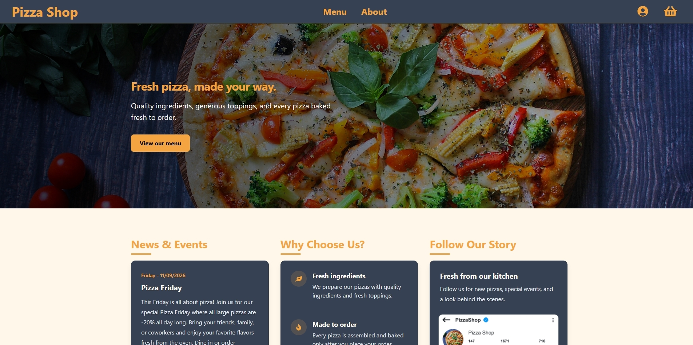
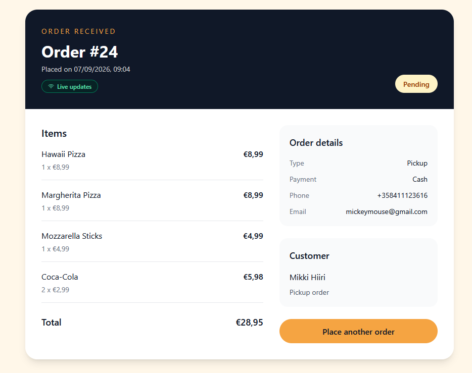
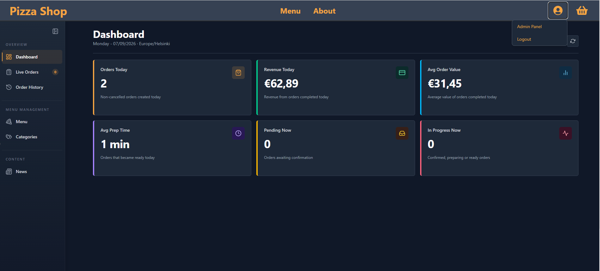
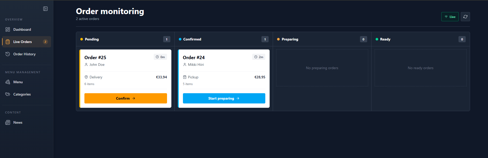

# Pizza Shop Frontend

Pizza Shop is the React frontend for a personal full-stack restaurant ordering project. It provides a customer-facing menu and checkout flow, account and order-management features, and a separate administration area for managing restaurant content and processing orders.

This repository contains the frontend only. The companion [Pizza Shop API repository](https://github.com/Vetelae/Pizza-API) contains the server, database, authentication, email, and API configuration.

## Screenshots

<table>
  <tr>
    <td width="50%">
      
      <br />
      <sub>Public home page with current news and restaurant content</sub>
    </td>
    <td width="50%">
      
      <br />
      <sub>Customer order details with live status updates</sub>
    </td>
  </tr>
  <tr>
    <td width="50%">
      
      <br />
      <sub>Administration dashboard with daily operational KPIs</sub>
    </td>
    <td width="50%">
      
      <br />
      <sub>Real-time order monitoring and status workflow</sub>
    </td>
  </tr>
</table>

## What the application does

Customers can browse the current menu, maintain a cart, and place pickup or delivery orders. Checkout works for both unauthenticated guests and registered customers. Registered customers can save contact details and review their order history, while guests receive a protected lookup link for following a specific order.

Administrators have a role-protected workspace for monitoring active orders, moving them through the preparation workflow, reviewing order history, viewing daily metrics, and managing categories, menu items, images, and news.

The cash and card options model a restaurant checkout choice; the project does not connect to a real payment provider.

## Main features

### Customer experience

- Responsive home, menu, and about pages
- Menu sections generated from API-provided categories and availability
- Guest and registered-customer carts with quantity controls and live totals
- Pickup and delivery checkout with conditional address validation
- Registration, email confirmation, login, logout, forgot-password, and reset-password flows
- Editable customer profile with saved checkout details
- Customer order history and individual order details
- Token-protected guest order lookup
- Real-time order status updates with connection feedback
- Restaurant gallery carousel and keyboard-accessible lightbox

### Administration

- Daily order, revenue, average-order-value, preparation-time, and workload KPIs
- Live order board for pending, confirmed, preparing, and ready orders
- Controlled status progression and order cancellation
- Paginated order history with search, status, date-range, and page-size filters
- CRUD interfaces for categories, menu items, and news
- Category and menu-item image uploads with previews
- Confirmation dialogs and action-level notifications

## Frontend tech stack

- **React 19** and **TypeScript**
- **Vite 7** for development and production builds
- **React Router** for navigation, nested layouts, URL parameters, and route guards
- **TanStack Query** for server state, caching, mutations, and cache reconciliation
- **Axios** with shared authentication and refresh interceptors
- **Zustand** for persisted authentication and shared panel state
- **React Hook Form** for customer, authentication, profile, and admin forms
- **Tailwind CSS 4** with project-specific theme tokens
- **SignalR client** for real-time customer and admin order updates
- **Sonner** for toast notifications
- **Embla Carousel** for the restaurant gallery
- **React Icons** for interface icons

## Frontend architecture

Network access follows a consistent feature flow:

```text
Page or component
    -> feature hook in src/hooks
    -> API service in src/api
    -> shared Axios client
    -> ASP.NET Core API
```

Pages coordinate data, mutations, notifications, and feature components. HTTP calls remain in API service modules, while TanStack Query hooks own queries, mutations, query keys, and related cache updates. Presentational components receive data and callbacks rather than calling the API directly.

Real-time events follow a parallel path: dedicated SignalR hooks receive events, update the relevant TanStack Query caches, and then reconcile them with targeted invalidation or refetching.

## Routing and navigation

Routes are declared centrally in `src/App.tsx`.

- `/home`, `/menu`, and `/about` provide the public site.
- `/orders/:orderId` displays a registered customer's order or a guest order when a valid lookup token is supplied.
- `/confirm-email` and `/reset-password` complete email-based account flows.
- `/profile` is available to authenticated customer accounts.
- `/admin/*` contains the nested dashboard, order monitoring, order history, category, menu-item, and news routes.

Customer and administrator routes use separate role-aware route guards. These guards control frontend navigation and presentation; the backend remains responsible for enforcing access to protected data and operations. Document titles are also updated from the current route.

Admin order-history filters are stored in URL search parameters, making pagination and filtered views refresh-safe and shareable.

## Authentication and authorization

The authentication store keeps the current user, role, access token, refresh token, and refresh state. Zustand persistence restores this state from `localStorage` after a reload.

The shared Axios client:

- attaches the current bearer token to protected requests;
- checks the access-token expiry before sending a request;
- refreshes an expiring token through the API;
- queues requests while one refresh is already in progress;
- retries the original request after a successful refresh; and
- clears authentication when the refresh session is rejected.

Public authentication endpoints opt out of token attachment. SignalR connections obtain a valid access token through the same authentication helper. The frontend recognizes `Admin` and registered-customer (`Guest`) roles when selecting protected routes and navigation options.

## API integration and real-time updates

`src/api/axiosClient.ts` provides the shared Axios instance and uses `VITE_API_URL` as its base URL. API services are grouped into public, authenticated-user, and administrator modules.

Guest carts use a browser-generated UUID sent in the `X-Session-Id` header. When authentication identity changes, the cart query cache is removed so one customer's cart cannot be displayed for another session.

SignalR is used for both customer order updates and the administration monitoring board. The connection hooks include automatic reconnect delays, connection-status UI, event buffering until the initial HTTP snapshot is ready, and fallback reconciliation on polling intervals, browser focus, visibility changes, and network reconnection.

The frontend has no direct third-party service integration. Email delivery and persistence are backend responsibilities; see the backend repository for those details.

## State management and data fetching

TanStack Query is the source of truth for remote data such as the menu, categories, news, cart, profiles, orders, and dashboard metrics. Mutations either write authoritative API responses directly into the cache or invalidate related queries such as lists, order details, and dashboard summaries.

Zustand is limited to shared client state:

- `authStore` owns authentication, identity, refresh state, and login-panel visibility.
- `cartStore` owns cart-panel visibility; cart contents remain in TanStack Query.

Queries that require authentication or valid identifiers use conditional execution. Public catalog data and profile data use feature-appropriate stale times, while dashboard metrics refresh periodically. The global query retry policy avoids retrying HTTP `429` responses.

## Forms and validation

React Hook Form is used for registration, login, password recovery, checkout, profile editing, and admin content forms. Validation includes required fields, email formats, password rules, numeric ranges, matching passwords, and a delivery address that becomes required only for delivery orders.

Forms display field-level errors, disable actions while submissions are pending, and reset when their source record or workflow changes. Authenticated profile data is used to prefill checkout fields when available.

## Styling, responsiveness, and accessibility

The interface is built directly with Tailwind CSS utilities and custom color tokens in `src/index.css`; no UI component library is used. Customer pages use light surfaces with dark content areas, while profile and administration screens use a dark workspace with orange accents. Reusable project components provide tables, cards, panels, dialogs, status indicators, and form modals.

Layouts use responsive Tailwind breakpoints for menu grids, checkout content, tables, dashboard cards, navigation, and the admin sidebar. Horizontal page overflow is constrained for smaller screens.

Accessibility considerations present in the implementation include:

- semantic headings, labels, lists, tables, and status regions;
- descriptive image alternative text and icon labels;
- visible keyboard focus styles;
- `aria-live`, `role="status"`, and `role="alert"` feedback;
- focus trapping and restoration in key panels and dialogs;
- Escape and arrow-key handling where appropriate;
- scroll locking for overlays; and
- reduced-motion behavior for animations and the gallery carousel.

These are implementation considerations rather than a claim of formal accessibility certification.

## Error handling and user feedback

Pages and feature components provide loading skeletons or status messages, empty states, contextual error messages, disabled pending actions, and retry controls. Rate-limit responses receive specific guidance instead of generic failures.

Sonner toasts report successful or failed user actions such as authentication and CRUD operations. Errors that belong to a particular form, cart item, query, or connection are rendered inline. The real-time order screens expose connected, reconnecting, and offline states so users can tell when displayed data may be stale.

## Other notable decisions

- Query cache updates are coordinated across active orders, order history, detail views, and dashboard summaries.
- SignalR events that arrive before an initial query snapshot are buffered to avoid overwriting newer data.
- Customer status events are timestamp-checked before being applied, preventing older events from replacing newer state.
- Public order query keys include the guest lookup token so protected guest responses do not share an unsafe cache entry.
- Currency and dates are formatted consistently for an English/European presentation using `Intl` APIs.
- Menu images are lazy-loaded and include unavailable-image fallbacks.
- All visual assets used by the portfolio interface were AI-generated for this project.

## Project structure

```text
docs/images/           README screenshots
src/
  api/
    admin/             Administrator API services
    public/            Public catalog, cart, order, and auth services
    user/              Authenticated-user API services
  components/
    about/             Gallery and lightbox
    admin/             Admin tables, forms, dashboard, and order UI
    auth/              Login and account-lifecycle forms
    customer/          Cart, checkout, and customer order UI
    user/              Customer route protection
  hooks/
    admin/             Admin queries, mutations, and SignalR lifecycle
    customer/          Customer SignalR lifecycle
    public/            Public/auth/cart queries and mutations
    user/              Authenticated order queries
  pages/               Route-level public, customer, and admin screens
  store/               Zustand authentication and panel state
  types/               API DTOs and domain types
  utils/               Formatting, image URL, status, and error helpers
```

## Local setup

### Prerequisites

- Node.js and npm
- A running instance of the [Pizza Shop API](https://github.com/Vetelae/Pizza-API)

### 1. Clone and install

```bash
git clone https://github.com/Vetelae/pizza-react.git
cd pizza-react
npm ci
```

### 2. Configure the backend connection

Create a local `.env` file in the project root:

```env
VITE_API_URL=https://localhost:7205/api
VITE_BASE_URL=https://localhost:7205
```

The variables are:

- `VITE_API_URL`: base URL for REST requests. The SignalR hub URL is derived from this value.
- `VITE_BASE_URL`: backend origin used to resolve uploaded category and menu-item image paths.

The values above match the backend's default HTTPS development profile. Change them if the API is hosted elsewhere, and configure the backend's allowed CORS origin for the frontend address.

Vite exposes every `VITE_*` variable to browser code. These variables must contain public configuration only—never passwords, tokens, signing keys, or other secrets. `.env` files are excluded from Git.

### 3. Run the application

Start the backend first, then run:

```bash
npm run dev
```

Vite normally serves the frontend at `http://localhost:5173`.

## Available commands

```bash
npm run dev      # Start the Vite development server
npm run lint     # Run ESLint
npm run build    # Type-check and create a production build
npm run preview  # Preview the production build locally
```

## Demo and deployment

No public live deployment or production demo account is currently provided. For local testing, the backend seeds a development-only administrator whose credentials are defined in its development seed code.

## Related repository

- [Pizza Shop API — ASP.NET Core backend](https://github.com/Vetelae/Pizza-API)
